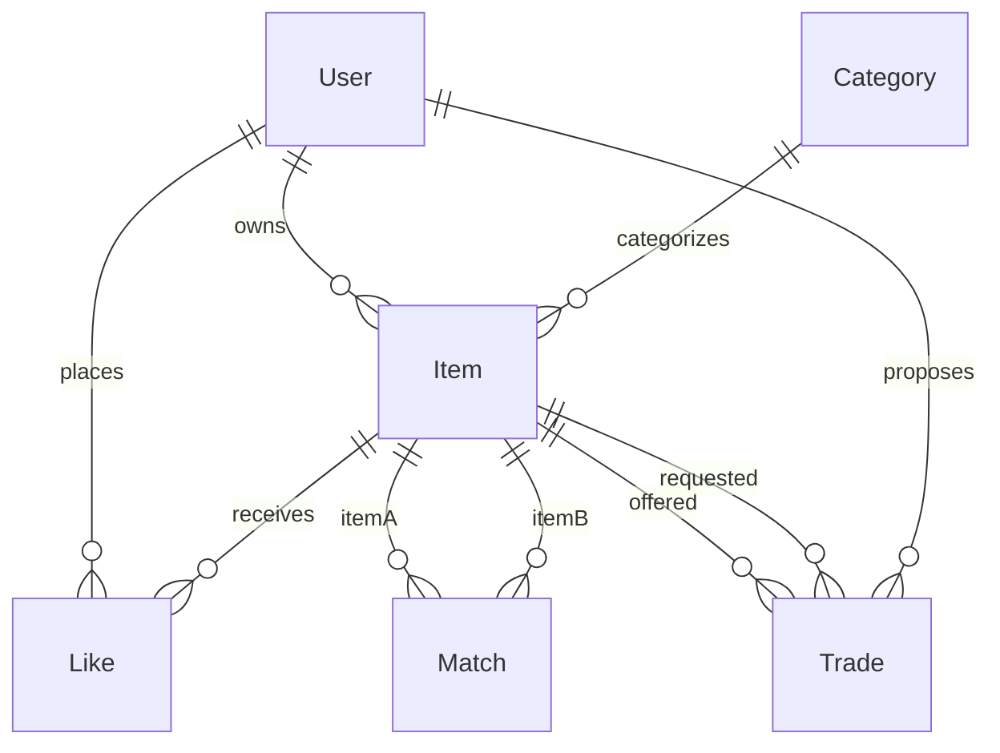
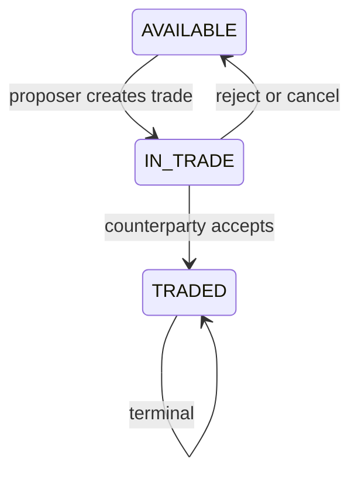

# Easy Exchange — approved plan

Class assignment (07-ITAI5050). Specs in `/specs` stay the source of truth. Existing draft: [../specs/01-user-registration.md](../specs/01-user-registration.md) (awaiting approval before application code). This document is the approved product/architecture plan. Do not write application code until specs are approved.

**Overview:** A small, locally demoable Django marketplace: public browse of Funko/Lego/TCG listings with JSON metadata, session auth, pairwise mutual likes as matches, and 1-for-1 trades with both-party confirmation plus atomic double-booking locks at propose time.

**Decisions from planning**

- Interest: like a listing; a **match** exists only when each owner has liked the other’s listing (pairwise 1-for-1).
- Trade: exactly one item vs one item; proposer proposes, counterparty accepts or rejects.
- Browse is public; list / like / trade require login.
- Deadline: **a few days** — keep the demo tiny.
- Preferred stack: Django + templates + SQLite JSON.
- Category metadata fields are fixed (see data model); do not invent extra keys.

---

## Decision log

- **Lock at propose, not at accept.** The original wording was: both users accept, then both items go `IN_TRADE`, then `TRADED`. That leaves a window where two overlapping proposes could both see `AVAILABLE` and book the same item. **Accepted deviation:** items move `AVAILABLE → IN_TRADE` when a trade is **proposed** (inside `transaction.atomic()` with a conditional update). Counterparty accept moves them `IN_TRADE → TRADED`. Reject/cancel returns them to `AVAILABLE`. This is the double-booking lock.

- Pairwise listing likes (not “match the person, then pick items”) so a match is already a 1-for-1 pair.

- SQLite `JSONField` for MVP; PostgreSQL JSONB / `SELECT FOR UPDATE` is a documented upgrade path, not a requirement.
- - Extended `metadata_schema` entries with optional `min`, `max` (int) and `choices` (str). Reason: the brief's goal is that adding a category needs only a new schema definition, so range and choice rules (for example `box_condition` 1-10, `card_condition` values) must live in the schema instead of being hard-coded in the validator. Invalid combinations (min/max on a str field, choices on an int field) raise a configuration error when the schema is loaded. Decided during the architecture spec review; details in `specs/00-architecture.md`.

- Likes are append-only (cut #2 from section 7 is taken): no unlike, no match removal. Decided in specs/05-likes-matches.md.

- New likes are allowed on `IN_TRADE` items and refused on `TRADED` items; a duplicate like is idempotent. `IN_TRADE` is reversible (reject or cancel returns the item to `AVAILABLE`); `TRADED` is terminal.

---

## 1. Tech stack options

**Option A (recommended): Django + server-rendered templates + SQLite `JSONField`**

- Pros: auth, admin, ORM, forms, and a local `runserver` demo in one framework; `JSONField` on SQLite is enough for per-category metadata; fits a few-day deadline.
- Cons: not PostgreSQL JSONB; row-level `SELECT FOR UPDATE` is weaker/no-op-ish on SQLite — we use conditional `UPDATE ... WHERE` instead.

**Option B: Flask + Jinja + SQLAlchemy + SQLite JSON**

- Pros: lighter, more explicit wiring.
- Cons: you rebuild auth, admin, and CSRF yourself; slower for this assignment.

**Option C: FastAPI + HTMX + PostgreSQL JSONB**

- Pros: JSONB and `SELECT ... FOR UPDATE`; nicer metadata queries.
- Cons: extra process (Postgres), more moving parts; overkill for a local class demo.

**Recommendation: Option A**, matching the chosen preference. Validate `item.metadata` in Python against the category’s `metadata_schema` (small field list, not a live JSON Schema engine). Postgres can wait.

Local demo: `python manage.py migrate && python manage.py seed && python manage.py runserver`. No cloud.

---

## 2. Data model

- **User**: email (unique, case-insensitive), display name, password hash. Django’s `AbstractUser` or a thin profile on `auth.User`. No OAuth, no email verify (already out of the registration spec).
- **Category**: `slug` (`funko`, `lego`, `tcg`), `name`, `metadata_schema` (JSON: list of fields with `key`, `label`, `type`, `required`, plus optional `min`, `max` (int fields) and `choices` (str fields)). Stretch sports stays out of DB seed.
- **Item** (listing): `owner`, `category`, `title`, `description`, `status` (`AVAILABLE` | `IN_TRADE` | `TRADED`), `metadata` (JSON object matching that category’s schema), `created_at`. No image upload in MVP.
- **Like**: `(user, item)` unique. Reject likes on own items. Public visitors cannot like.
- **Match**: pair of items `(item_a, item_b)` with `item_a_id < item_b_id` uniqueness. Created when a like completes a **reciprocal pair**: owner of X liked Y **and** owner of Y liked X.
- **Trade**: `item_offered` (proposer’s item), `item_requested` (counterparty’s item), `proposer`, `counterparty`, `status` (`PROPOSED` | `ACCEPTED` | `REJECTED` | `CANCELLED`), timestamps. Only allowed if a Match exists for those two items.

**MVP metadata schemas (exact — listing forms and seed must use these keys only)**

Encode these in category `metadata_schema` and in listing specs. Do not add character/line/vaulted/set number/etc.

- **Funko**
  - `box_condition` (int, required): 1–10
  - `original_box_included` (bool, required)
  - `serial_number` (str, required)
- **Lego**
  - `sealed_misb` (bool, required): sealed mint-in-sealed-box
  - `missing_parts` (bool, required)
  - `year` (int, required)
- **TCG**
  - `grading` (str, optional): company + score, e.g. `PSA 10`
  - `card_condition` (str, required): `Mint` | `Near Mint` | `Played`

---

## 3. Listing state machine and double-booking

**Happy path**

1. Both items `AVAILABLE`. Reciprocal likes create a Match.
2. Either matched user **proposes** a trade on that pair.
3. Preconditions: proposer owns `item_offered`; a Match exists; neither item is already in a non-terminal trade.
4. On propose (lock): both items → `IN_TRADE`; trade → `PROPOSED`.
5. Counterparty **accepts**: trade → `ACCEPTED`; both items → `TRADED` (terminal).
6. Counterparty **rejects** or proposer **cancels**: trade → `REJECTED`/`CANCELLED`; both items → `AVAILABLE`.

**Double-booking prevention (atomic conditional update)**

Do **not** read status, then update in a second step. Inside `transaction.atomic()`:

1. `UPDATE item SET status='IN_TRADE' WHERE id IN (offered_id, requested_id) AND status='AVAILABLE'`.
2. If the **affected row count is not 2**, roll back the whole transaction and refuse the propose (one or both items were already locked or traded).
3. Only if count == 2, insert the `Trade` row as `PROPOSED` and commit.

Likes on locked/traded items may remain for history but **cannot** start a new trade. New likes are allowed on `IN_TRADE` items and refused on `TRADED` items; a duplicate like is idempotent. Other matches involving a locked item are inert until cancel returns `AVAILABLE`, or are dead if the item is `TRADED`. An item may have at most one trade in `PROPOSED`.

**PostgreSQL later:** the same `UPDATE ... WHERE status='AVAILABLE'` plus row count still works and is the portable pattern. The usual PG tightening is to `SELECT ... FOR UPDATE` both item rows (ordered by id to avoid deadlocks) inside the transaction, then update. SQLite does not give the same row-level lock semantics, which is why the conditional update + row count is the MVP mechanism.

No payments, shipping, or chat (brief: out of scope).

---

## 4. Seed data

Management command (or equivalent) after migrate. Minimum:

- **Two demo users** (known emails/passwords for the live demo).
- **Each user has one listing in every MVP category** (Funko, Lego, TCG) — six listings total, metadata filled with the exact keys above.
- **One pre-made reciprocal like pair** (user A liked one of user B’s listings, and user B liked one of user A’s) so a **Match** exists on first load and can be shown without clicking through likes.

All six seed listings start `AVAILABLE`; none should be pre-traded. The match is the live hook for proposing a trade in the demo.

---

## 5. Testing approach

Focus tests on the trade service, not the templates.

**State machine**

- Propose on two `AVAILABLE` matched items: both become `IN_TRADE`, trade is `PROPOSED`.
- Accept: both become `TRADED`, trade is `ACCEPTED`; further propose/accept/cancel is rejected.
- Reject and cancel: both return to `AVAILABLE`, trade is terminal (`REJECTED` / `CANCELLED`); a new propose is allowed.
- Cannot propose without a reciprocal match; cannot propose on own item vs own item.

**Double-booking**

- After a successful propose, a second propose that includes either item must fail (affected row count is not 2); first trade remains `PROPOSED`, statuses stay `IN_TRADE`.
- Prefer asserting via the service API (two sequential proposes). A true parallel race is optional; the contract under test is “conditional update requires two `AVAILABLE` rows.”

**Metadata (lightweight)**

- Creating a Funko/Lego/TCG listing rejects missing required keys and out-of-range `box_condition` / invalid `card_condition`. Optional TCG `grading` may be blank.

---

## 6. Phased implementation (small tasks)

Work **one spec/task at a time**. After each task, stop. Specs first; you approve; then code.

**Phase 0 — Specs (this process, no app code)**

- Approve/adjust [../specs/01-user-registration.md](../specs/01-user-registration.md)
- Draft and approve: login/session; categories + create/edit listing (exact metadata fields); public browse/filter; likes + matches; trades + atomic lock; seed data; test cases for the state machine
- Update [../PROCESS_LOG.md](../PROCESS_LOG.md) Step 2 with these planning decisions (only when asked)

**Phase 1 — Skeleton + auth**

- Django project, apps (`accounts`, `catalog`, `trades`), settings, SQLite
- Registration per approved spec (`/register`, hashed password, redirect to login, no auto-login)
- Login / logout (session cookie), “already have an account” link target

**Phase 2 — Catalog (demo-able alone)**

- Category table + schemas; create/edit listing form that shows fields from `metadata_schema`
- Public home/browse: filter by category; listing detail (read-only for anonymous)
- Seed command matching section 4

**Phase 3 — Likes and matches**

- Like button on listing detail (auth required). Likes are append-only: there is no unlike.
- Match created when reciprocal likes appear. A Match is never removed.
- Simple “Matches” page: pairs you can propose a trade on (seed pair visible immediately)

**Phase 4 — Trades (core state machine)**

- Propose / accept / reject / cancel using conditional `UPDATE` + row count
- Status badges on listings
- Tests listed in section 5

**Phase 5 — Demo polish only if time**

- Nav, empty states, flash messages
- Optional listing image URL — not uploads

---

## 7. Risks, assumptions, cuts

**Assumptions**

- Text listings are enough for the demo; no file uploads.
- Pairwise listing likes (not “match the person, then pick items”).
- Specs are approved before any application code (course workflow).
- Deadline is a few days; seed data (including the reciprocal like) is how the demo looks good.
- Metadata keys above are the only category fields, even if [project-brief.md](project-brief.md) on disk is still shorter — listing specs will carry the field lists.

**Risks**

- Mutual-like + propose/accept is two UX steps; easy to run out of time on Phase 4.
- Dynamic metadata forms are fiddly; schemas stay at the three/two fields above.
- SQLite still cannot match PostgreSQL row locks; conditional update is the mitigation.
- Scope creep (chat, photos, search, sports) vs the brief.

**Cut first if time runs short (keep the demo)**

1. Image URLs and any search-beyond-category-filter
2. Unlike / match teardown polish (likes can be append-only)
3. Dedicated Matches page — propose from the listing instead
4. Stored Match rows — derive the pair at propose time from two likes
5. Last resort: skip `IN_TRADE` as a visible lingering state and jump AVAILABLE → TRADED on accept, still locking in the transaction (weaker story for the assignment; avoid unless necessary)

**Do not cut:** registration, login, create listing with the exact category JSON, public browse, seed with two users × three categories and one match, at least one successful 1-for-1 trade in the demo, tests for transitions and double-booking.

**Out of scope (brief):** Neo4j, brokers, native mobile, payments, shipping, sports category.
