# Easy Exchange — implementation tasks

Ordered, one-session tasks for plan section 6 of [plan.md](plan.md): Phase 1 skeleton + auth, Phase 2 catalog + seed, Phase 3 likes and matches, Phase 4 trades. Specs in `/specs` are the source of truth; each task names the spec files and requirement numbers it implements, the files it creates, the must-have tests, and a "done when" check.

**How to use this list**

- One task per agent session. Stop when its "done when" check passes, then start the next.
- Every task runs the full suite too: `python manage.py test` must stay green after each task.
- Tests the specs mark as nice-to-have are not part of any task. They are listed under *If time runs short*.
- Spec status: `00`–`07` are **Approved**.
- Never commit or push unless asked.

**One ordering change versus the plan.** Plan Phase 2 includes the seed command, but seed must create its reciprocal pair by calling `like_item` ([07-seed-data](../specs/07-seed-data.md) requirements 17–19). The `like_item` service (task 8) therefore comes right before seed (task 9). The like button and the Matches page stay after seed.

```mermaid
flowchart LR
  t0[T0 setup] --> t1[T1 register]
  t1 --> t2[T2 login]
  t2 --> t3[T3 models and validator]
  t3 --> t4[T4 create listing]
  t4 --> t5[T5 edit listing]
  t5 --> t6[T6 browse]
  t6 --> t7[T7 detail]
  t7 --> t8[T8 like_item]
  t8 --> t9[T9 seed]
  t9 --> t10[T10 like UI]
  t10 --> t11[T11 matches page]
  t11 --> t12[T12 propose service]
  t12 --> t13[T13 resolve service]
  t13 --> t14[T14 trade views]
  t14 --> t15[T15 trade UI]
```

---

## Phase 1 — Skeleton + auth

### Task 0 — Project setup

- **Goal:** A local Django project that migrates, with the custom `accounts.User` set as `AUTH_USER_MODEL` before the first migration is created or run.
- **Specs:** [00-architecture](../specs/00-architecture.md) — *Stack decision*, *Django app structure* (app table, folder layout, both business rules), `User` model section. [01-user-registration](../specs/01-user-registration.md) *Data and business rules* for the model shape only: email unique case-insensitively and stored trimmed + lowercased, `display_name` 2–40, Django password hash. No register view in this task.
- **Creates:**
  - `requirements.txt` — `Django` (5.x), nothing else.
  - `.gitignore` — `.venv`, `db.sqlite3`, `__pycache__/` (also `*.pyc`).
  - `manage.py`, `config/__init__.py`, `config/settings.py`, `config/urls.py`, `config/wsgi.py`, `config/asgi.py`.
  - App packages `accounts/`, `catalog/`, `trades/` (each with `apps.py`, `migrations/`, `tests/__init__.py`), all three in `INSTALLED_APPS`.
  - `accounts/models.py` — `User(AbstractUser)` with `username = None`, `email` unique, `display_name`, `USERNAME_FIELD = "email"`, `REQUIRED_FIELDS = ["display_name"]`, a manager whose `create_user` / `create_superuser` normalize the email (trim, lowercase).
  - `accounts/migrations/0001_initial.py`.
  - `templates/` directory registered in `TEMPLATES["DIRS"]` (empty for now; `base.html` is task 2).
  - Settings: SQLite default database, `AUTH_USER_MODEL = "accounts.User"`, default `AUTH_PASSWORD_VALIDATORS`, `CsrfViewMiddleware` and sessions middleware on (Django defaults).
- **Order inside the task (matters):** create the venv and install Django → `django-admin startproject config .` → `startapp` the three apps → write `User` → set `AUTH_USER_MODEL` → **then** the first `makemigrations` and `migrate`. Never run `migrate` while `AUTH_USER_MODEL` still points at `auth.User`; if that happens, delete `db.sqlite3` and the generated migration and redo.
- **Must-have tests** — `accounts/tests/test_user_model.py`:
  - `settings.AUTH_USER_MODEL == "accounts.User"` and `get_user_model().USERNAME_FIELD == "email"`.
  - `create_user(email="  Ada@Example.COM ", display_name="Ada", password="ExchangeDemo1!")` stores `ada@example.com`, `check_password` succeeds, and the stored `password` is not the plaintext.
  - Creating a second user with the same email in a different case raises an integrity error.
- **Done when:**
  - `python -m venv .venv`, activate, `pip install -r requirements.txt`.
  - `python manage.py check` prints no issues.
  - `python manage.py migrate` applies `accounts.0001_initial` (and `admin`, `auth`, `contenttypes`, `sessions`) with no error.
  - `python manage.py makemigrations --check` reports no changes.
  - `python manage.py test accounts.tests.test_user_model` passes.
  - `git status` shows `.venv/` and `db.sqlite3` as ignored.

### Task 1 — Registration

- **Goal:** `GET/POST /register` creates a user with a hashed password and redirects to `/login` without signing them in.
- **Specs:** [01-user-registration](../specs/01-user-registration.md) requirements 1–10; *Data and business rules*; *Open questions* decision: an already logged-in `GET /register` redirects to `/`.
- **Creates:** `accounts/forms.py` (`RegistrationForm`: display name, email, password, confirm), `accounts/views.py` (`register`), `accounts/urls.py`, `accounts/templates/accounts/register.html`, `include("accounts.urls")` in `config/urls.py`, `accounts/tests/test_registration.py`.
- **Must-have tests** — spec 01 test cases 1–8: valid registration (hash stored, redirect to `/login`, client not authenticated); duplicate email differing only by case / whitespace → `An account with this email already exists.`; mismatched passwords; short password; invalid email; each field missing in turn and all missing; re-render keeps display name and email and clears both passwords; `POST` without CSRF token rejected (CSRF checks enabled on the test client).
- **Done when:** `python manage.py test accounts.tests.test_registration` passes. Manual: `runserver`, open `/register`, submit a new account, land on `/login` while still signed out; the page shows the link `Already have an account? Sign in`. (Until task 2, `/login` is a 404; assert the redirect target only.)

### Task 2 — Login, logout, session, base layout

- **Goal:** Email + password session login with safe `next`, `POST`-only logout, and the shared header that switches between anonymous and logged-in state.
- **Specs:** [02-login-session](../specs/02-login-session.md) requirements 1–17 and 21 (login, logout, navigation state, `next` safety); *Data and business rules* (`LOGIN_URL = "/login"`, `SESSION_COOKIE_SECURE = False`, generic failure message). Requirements 18–20 are the rule that later protected routes follow; their tests (cases 11–14) are completed by tasks 4, 7, 10, 11, and 14.
- **Creates:** `LoginForm` in `accounts/forms.py`, `login_view` and `logout_view` in `accounts/views.py`, routes `/login` and `/logout` in `accounts/urls.py`, `accounts/templates/accounts/login.html`, `templates/base.html` (header: `Sign in` + `Register` links for anonymous; `display_name` + `Logout` `POST` form for logged in; brand text placeholder that task 6 turns into a link to `/`), settings `LOGIN_URL = "/login"`, `SESSION_COOKIE_SECURE = False`, `accounts/tests/test_login.py`. Also apply the already-logged-in redirect to `GET /register` from task 1 if it was not done there.
- **Must-have tests** — spec 02 test cases 1–10 and 15–20: valid login redirects to `/` and sets `sessionid`; normalized email logs in; wrong password / unknown email / inactive user all give the same `Invalid email or password.` with status `200`, email prefilled, password empty, not authenticated; empty fields; safe `next` honoured; `https://evil.example/` and `//evil.example/` ignored; already logged in `GET /login` → `/`; session key rotates on login; logout flushes session and redirects to `/`; `GET /logout` → `405` and still logged in; logout without CSRF → `403`; anonymous `POST /logout` → `/`; login without CSRF → `403`; header shows the right links for each state. A safe `next` may point at a path that does not exist yet (`/listings/new`); assert the redirect `Location` only.
- **Done when:** `python manage.py test accounts.tests.test_login` passes. Manual: register, sign in at `/login`, header shows your display name and a `Logout` button; `/` renders (a bare page until task 6 is fine); press `Logout`, header shows `Sign in` and `Register`; typing `/logout` in the address bar returns `405` and leaves you signed in.

---

## Phase 2 — Catalog + seed

### Task 3 — `Category`, `Item`, metadata validator

- **Goal:** The two catalog models and a generic validator pair with no per-slug branches: `validate_metadata_schema(schema)` and `validate_metadata(category, metadata)`.
- **Specs:** [00-architecture](../specs/00-architecture.md) — `Category` and `Item` sections, *Category metadata schemas* (storage, schema configuration check, server-side validation checks 1–5), *Testing approach* 13–20. [03-listings](../specs/03-listings.md) requirements 1–4 (the exact three schemas, labels, `min`/`max`/`choices`, slug order) and the validator-only messages in *Data and business rules*.
- **Creates:** `catalog/models.py` (`Category`: `slug` unique, `name`, `metadata_schema` JSONField; `Item`: `owner`, `category`, `title` max 120, `description`, `status` choices `AVAILABLE | IN_TRADE | TRADED` default `AVAILABLE`, `metadata` JSONField, `created_at`), `catalog/validators.py` (both functions plus a configuration exception naming slug / entry key), `catalog/migrations/0001_initial.py`, `catalog/tests/test_validators.py`. Tests build their own `Category` rows (seed does not exist yet); put the three MVP schema literals in a module such as `catalog/schemas.py` so task 9 can reuse them.
- **Must-have tests** — spec 03 test cases 1–12: valid metadata per category; missing required keys (`Missing required field "<key>".`, tcg `grading` may be absent); blank required string rejected, blank `grading` accepted; `box_condition` 0 / 11 rejected, 1 / 10 accepted; `box_condition` `"7"`, `7.5`, `true` rejected as whole-number errors; `card_condition` `Good` / `mint` rejected with the choices message; wrong types; undeclared key `character`; non-object (`[]`, `"x"`, `None`); required `bool` `false` valid; generic schema in a test `Category` enforced without code change; `validate_metadata_schema` raises for every configuration error listed and passes the three MVP schemas.
- **Done when:** `python manage.py test catalog.tests.test_validators` passes and `python manage.py makemigrations --check` reports no changes.

### Task 4 — Create listing

- **Goal:** Logged-in, two-step create at `/listings/new`: choose a category, then a form whose metadata inputs are built from `metadata_schema`; saves an `AVAILABLE` `Item`.
- **Specs:** [03-listings](../specs/03-listings.md) requirements 5–15 and 25 (routes, step 1 / step 2, dynamic inputs table, validation order, error messages incl. the custom `Ensure this value is between <min> and <max>.`, blank optional `str` omitted, redirect to `/listings/<id>`, `New listing` header link). [02-login-session](../specs/02-login-session.md) requirements 19–20 as applied to `/listings/new`.
- **Creates:** `catalog/forms.py` (`ListingForm` built from a `Category`; `IntegerField(min_value, max_value)` with the combined-range `error_messages` when both bounds exist, `BooleanField(required=False)`, `CharField`, `ChoiceField` with a blank option), `catalog/views.py` (`listing_create`), `catalog/urls.py`, `include("catalog.urls")` in `config/urls.py`, `catalog/templates/catalog/listing_form.html` (category `GET` select + `Continue`, then the `POST` form), the `New listing` link in `templates/base.html` for logged-in users, `catalog/tests/test_create_listing.py`.
- **Must-have tests** — spec 03 test cases 13–24: anonymous `GET` → `/login?next=/listings/new`, anonymous `POST` → `/login` with no `next` and no `Item`; step 1 renders the chooser only; step 2 renders exactly the right inputs per slug with the right widgets and attributes; unknown slug → `404` on `GET` and `POST`; valid create per category (exact `metadata`, unchecked checkbox → `false`, blank `grading` omitted); `box_condition` `0` / `11` / `abc` / `7.5` messages, with neither single-bound default message present for `0` / `11`; blank / `Good` `card_condition`; missing required fields; undeclared `character` input ignored; re-render keeps values; CSRF; `New listing` link only when logged in. The redirect target is `/listings/<id>` even though detail arrives in task 7 — assert `Location`, do not follow.
- **Done when:** `python manage.py test catalog.tests.test_create_listing` passes. Manual (seedless): sign in, click `New listing`, pick Funko, `Continue`, fill the form, submit, and see a redirect to `/listings/<id>` (404 until task 7). Repeat after task 7 to see the detail page.

### Task 5 — Edit listing

- **Goal:** Owner-only edit while `AVAILABLE`, saved with a conditional update so a stale form cannot overwrite an item that became `IN_TRADE`.
- **Specs:** [03-listings](../specs/03-listings.md) requirements 16–23, 25–26 (routes, `404` / `403` messages, read-only category, pre-fill, conditional `UPDATE ... WHERE status='AVAILABLE'`, never writing `status` / `owner` / `category`). Requirement 24 (where the `Edit` link appears) is task 7.
- **Creates:** `listing_edit` in `catalog/views.py`, route `/listings/<id>/edit`, `catalog/templates/catalog/listing_edit.html`, `catalog/tests/test_edit_listing.py`.
- **Must-have tests** — spec 03 test cases 25–31: anonymous redirects (`GET` with `next`, `POST` without); non-owner `403` `You can only edit your own listings.`; owner of `IN_TRADE` / `TRADED` item `403` `This listing is in a trade and cannot be edited.` (test sets `Item.status` directly); pre-filled form with the category as text and no `category` input, blank `grading` for a tcg item without the key; valid edit updates only `title` / `description` / `metadata` and ignores `category` / `status` in the body; invalid edit leaves the row byte-for-byte unchanged; stale edit (`status` flipped between `GET` and `POST`) → `403` and 0 rows written.
- **Done when:** `python manage.py test catalog.tests.test_edit_listing` passes. Manual after task 7: as the owner of an `AVAILABLE` listing, open `/listings/<id>/edit`, change the title, save, and see the new title on the detail page; open the same URL as another user and get `403`.

### Task 6 — Public browse

- **Goal:** `GET /` lists every `Item` in every status, newest first, with a category filter built from the `Category` table and public status badges.
- **Specs:** [04-browse](../specs/04-browse.md) requirements 1–9, 13 (badge markup), 19 (brand link), 20–21; *Data and business rules* (`order_by("-created_at", "-id")`, `select_related`, filter resolution, badge class). [02-login-session](../specs/02-login-session.md) requirement 18 (public, never redirects).
- **Creates:** `browse` in `catalog/views.py`, `path("", ...)` for `/` in `config/urls.py` (replaces whatever placeholder task 2 used), `catalog/templates/catalog/browse.html`, a shared badge include (for example `catalog/templates/catalog/_status_badge.html`) reused by tasks 7, 11, 15, the brand link to `/` in `templates/base.html`, `catalog/tests/test_browse.py`.
- **Must-have tests** — spec 04 test cases 1–11: public for anonymous and logged in with identical lists; newest first; `id` tie-break; all three statuses shown with matching badge text; card contains title link, category name, badge, owner `display_name` and no description / metadata / `Edit` / forms; filter by each slug; `/`, `/?category=all`, `/?category=` identical; `/?category=sports` → `404`; filter links in order with `aria-current="page"` on the active one only; empty states `No listings yet.` and `No Trading Card Games listings yet.`; bounded query count with `assertNumQueries`.
- **Done when:** `python manage.py test catalog.tests.test_browse` passes. Manual: open `/` signed out and see either `No listings yet.` or the cards; `/?category=funko` narrows the list; `/?category=sports` returns `404`; the header brand links back to `/`.

### Task 7 — Listing detail

- **Goal:** Public `/listings/<id>` with schema-driven metadata rows, the status badge, the owner-only `Edit` link, the anonymous `Sign in to like or trade` link, and an empty `listing_actions` block for logged-in users (filled in task 10).
- **Specs:** [04-browse](../specs/04-browse.md) requirements 10–18 (content order, metadata rendering table, `Edit` link rule, action area, `405` on `POST`); *Data and business rules* on owner privacy (no email anywhere). [03-listings](../specs/03-listings.md) requirement 24. [02-login-session](../specs/02-login-session.md) requirements 18 and 20 (public page; anonymous replacement link with `next=/listings/<id>`).
- **Creates:** `listing_detail` in `catalog/views.py`, route `/listings/<id>`, `catalog/templates/catalog/item_detail.html` (with ``), `catalog/tests/test_detail.py`.
- **Must-have tests** — spec 04 test cases 12–23, which also close spec 03 case 32 and spec 02 cases 13–14 for this page: public `200`; `404` for a missing id; metadata rendering per category (`7` / `Yes` / `FP-0001`, `No` / `No` / `2019`, `—` for absent `grading`, `PSA 10` when present); core fields present; `<script>` escaped; `POST` → `405`; badge text and class for every status × role; `Edit` link visibility matrix; anonymous sees `Sign in to like or trade` → `/login?next=/listings/<id>` and no like / trade `<form>`; logged in does not see that link; brand link; owner email never in the body for any viewer, and no `@` address at all.
- **Done when:** `python manage.py test catalog.tests.test_detail` passes, and `python manage.py test catalog accounts` is fully green. Manual: open a listing signed out: raw status text in the badge, one Details row per schema entry, the sign-in link; sign in as the owner: an `Edit` link appears; create a listing via task 4's flow and land on its detail page.

### Task 8 — `like_item` service

- **Goal:** `Like` and `Match` models and the single creation path `like_item(user, item)` with the reciprocal check and `LikeNotAllowed`.
- **Specs:** [00-architecture](../specs/00-architecture.md) — `Like` and `Match` sections (unique `(user, item)`; unique `(item_a, item_b)` plus check `item_a_id < item_b_id`). [05-likes-matches](../specs/05-likes-matches.md) requirements 9–14 (atomic block, precondition order and messages, idempotent get-or-create, reciprocal query, one `Match` per completed pair, return value) and *Data and business rules*.
- **Creates:** `trades/models.py` (`Like`, `Match` with `UniqueConstraint` and `CheckConstraint`), `trades/services.py` (`LikeNotAllowed`, `like_item`), `trades/migrations/0001_initial.py`, `trades/tests/test_like_item.py`. Add `trades` to `INSTALLED_APPS` if task 0 left it out.
- **Must-have tests** — spec 05 test cases 1–13: own item refused with `You cannot like your own listing.`; single like, no match, empty return list; duplicate like idempotent; reciprocal like creates one `Match` ordered by `id` (both creation orders); order of likes does not matter; repeated reciprocal pair creates no second match; one like completes several pairs; existing matches untouched when more complete; no cross-user matches; unique and check constraints raise on direct inserts; atomicity (patched `Match` creation rolls back the `Like`); `IN_TRADE` item may be liked; `TRADED` item refused with `This listing has already been traded.`, while the caller's own `TRADED` item still completes a match.
- **Done when:** `python manage.py test trades.tests.test_like_item` passes and `python manage.py makemigrations --check` reports no changes.

### Task 9 — Seed command

- **Goal:** `python manage.py seed` fills a migrated database with the demo data and is safe to re-run: 3 categories, 2 users, 6 `AVAILABLE` items, 2 likes, 1 match, 0 trades.
- **Specs:** [07-seed-data](../specs/07-seed-data.md) requirements 1–21 (command, idempotency, single transaction, exact stdout line, category schemas, `ada@example.com` / `ExchangeDemo1!`, `ben@example.com` / `ExchangeDemo2!`, item titles / descriptions / metadata, `(owner, category)` slot rule, `like_item(Ada, Ben's funko)` then `like_item(Ben, Ada's funko)`, no trades, no other slugs). [03-listings](../specs/03-listings.md) requirements 1–3 (the category rows seed inserts).
- **Creates:** `catalog/management/__init__.py`, `catalog/management/commands/__init__.py`, `catalog/management/commands/seed.py` (reuses the schema literals from task 3 and calls `validate_metadata_schema`, `validate_metadata`, `like_item`; never `Like.objects.create` / `Match.objects.create`), `catalog/tests/test_seed.py`.
- **Must-have tests** — spec 07 test cases 1–6: three categories with deep-equal schemas and no `sports`; two users with hashed demo passwords; six valid `AVAILABLE` items matching the tables (Ben's tcg has no `grading`); two likes, one correctly ordered match, zero trades; patched no-op `like_item` leaves `Match` count 0 and was called twice in order; second run leaves counts, primary keys, hashes, and item fields unchanged and prints the same line.
- **Done when:** `python manage.py test catalog.tests.test_seed` passes; then on the dev database `python manage.py migrate && python manage.py seed` prints exactly `Seed complete: 3 categories, 2 users, 6 items, 1 match, 0 trades.`; running `python manage.py seed` again prints the same line and `/` still shows six listings. Sign in as `ada@example.com` / `ExchangeDemo1!` to confirm the demo credentials.

---

## Phase 3 — Likes and matches

### Task 10 — Like button

- **Goal:** `POST /listings/<id>/like` calls `like_item`, and the detail page's `listing_actions` block shows `Like`, `Liked`, or `Liked` + `See match` according to the viewer.
- **Specs:** [05-likes-matches](../specs/05-likes-matches.md) requirements 1–8 (route, `405` on `GET`, `404`, `403` messages, redirect back to detail, CSRF, control table incl. the `TRADED` and owner cases). [02-login-session](../specs/02-login-session.md) requirement 20 (anonymous `POST` → `/login`, no `next`). [04-browse](../specs/04-browse.md) requirement 17 (the block being filled).
- **Creates:** `like` view in `trades/views.py`, `trades/urls.py` with `/listings/<id>/like`, `include("trades.urls")` in `config/urls.py`, `trades/templates/trades/_like_control.html` included from `item_detail.html`'s `listing_actions` block (the detail view passes `viewer_has_liked` and `has_match_with_viewer` computed with two `exists()` queries), `trades/tests/test_like_view.py`.
- **Must-have tests** — spec 05 test cases 14–29, which close spec 02 case 12 for the like route and spec 04 case 21: anonymous `POST` → exactly `/login`, counts unchanged; `GET` → `405`; `404`; own item `403`; `TRADED` item via view `403`; `IN_TRADE` item via view `302` + one `Like`; valid like redirects to `/listings/<id>`; duplicate via view is the same redirect; match created through two view posts; CSRF; control rendering: `Like` form for not-yet-liked `AVAILABLE` / `IN_TRADE`, nothing for not-yet-liked `TRADED`, `Liked` span after liking (also after the item becomes `TRADED`), `See match` → `/matches` only when a match with the viewer exists, owner sees nothing, anonymous sees nothing from this spec.
- **Done when:** `python manage.py test trades.tests.test_like_view` passes. Manual with seed data: sign in as Ada, open Ben's Lego listing, press `Like`, land back on the listing with `Liked`; open Ben's Funko listing and see `Liked` followed by `See match` (the seeded pair); open one of Ada's own listings and see no like control.

### Task 11 — Matches page (pairs)

- **Goal:** `GET /matches` lists the user's `Match` rows from their side, with an empty state, a `Matches` header link, and the two reserved blocks `match_actions` (per row) and `matches_trades` (page level) left empty for Phase 4.
- **Specs:** [05-likes-matches](../specs/05-likes-matches.md) requirements 15–22 (route, `405` on `POST`, row contents, ordering by `Match.id`, empty state text and `Browse listings` link, reserved blocks, header link, read-only); *Data and business rules* query shape. [02-login-session](../specs/02-login-session.md) requirement 19 (anonymous `GET` → `/login?next=/matches`).
- **Creates:** `matches` view in `trades/views.py`, route `/matches`, `trades/templates/trades/matches.html` (with `` per row and `` after the list; the `Match` rows pre-split into "your item" / "their item" in the view), `Matches` link in `templates/base.html` for logged-in users, `trades/tests/test_matches.py`.
- **Must-have tests** — spec 05 test cases 30–39, which close spec 02 case 11 for this page: anonymous redirect with `next`; empty state; pair rendered from both sides with titles linking to detail, category names, badges, other owner's `display_name`, and no email; third user excluded; ascending `Match.id` order; `IN_TRADE` / `TRADED` pairs still listed with their badges; reserved blocks present; `POST` → `405`; bounded query count; `Matches` header link only when logged in.
- **Done when:** `python manage.py test trades.tests.test_matches` passes, and `python manage.py test` is fully green. Manual: sign in as Ada, click `Matches`, see one row with Ada's Funko listing as "Your item" and Ben's Funko listing as "Their item", both badges `AVAILABLE`; sign in as Ben and see the same pair mirrored; a freshly registered user sees `No matches yet.` with a `Browse listings` link.

---

## Phase 4 — Trades

### Task 12 — `Trade` model and `propose_trade` (the lock)

- **Goal:** The `Trade` model and `propose_trade(user, item_offered, item_requested)`: preconditions a–c, then one conditional `UPDATE ... WHERE status='AVAILABLE'` on both items whose row count must be exactly 2, else `TradeConflict` and full rollback.
- **Specs:** [00-architecture](../specs/00-architecture.md) — `Trade` section, *State machine*, *Double-booking prevention* (propose part). [06-trades](../specs/06-trades.md) requirements 10–13 and the *Data and business rules* on the three exceptions, the lock, and `created_at == updated_at` on create.
- **Creates:** `Trade` in `trades/models.py` (status choices `PROPOSED | ACCEPTED | REJECTED | CANCELLED`, `created_at`, `updated_at`), `trades/migrations/0002_trade.py`, `TradeNotAllowed`, `TradeConflict`, `TradeInvariantError`, and `propose_trade` in `trades/services.py`, `trades/tests/test_propose.py`. Fixtures build `Match` rows through `like_item`, never by direct insert.
- **Must-have tests** — spec 06 test cases 1, 2, 7, 9 (create half), 10, 11, 12, 13: propose happy path (both `IN_TRADE`, one `PROPOSED` trade with the right four parties, `created_at == updated_at`); either owner may propose; preconditions a / b / c with their exact messages and no status change; **`second propose on a locked item is refused`** — the demo test, named so it reads that way in the test output: after `propose_trade(A, X, Y)`, `propose_trade(C, Z, X)` and `propose_trade(A, X, Z)` raise `TradeConflict` with `One of these listings is no longer available.`, Z stays `AVAILABLE`, X and Y stay `IN_TRADE`, first trade stays `PROPOSED`, exactly one `Trade` row; locked `item_requested` refused the same way; one item `TRADED` → the other item's single update is rolled back; patched `Trade` creation rolls back both item updates. Case 15 (threaded race) is nice-to-have and not scheduled.
- **Done when:** `python manage.py test trades.tests.test_propose` passes and the output lists a test whose name reads `second propose on a locked item is refused`; `python manage.py makemigrations --check` reports no changes.

### Task 13 — `accept_trade`, `reject_trade`, `cancel_trade`

- **Goal:** Resolve a `PROPOSED` trade with the same conditional-update pattern: authorization first (`TradeNotAllowed`), then `UPDATE trade WHERE status='PROPOSED'` (count 1, else `TradeConflict`), then `UPDATE items WHERE status='IN_TRADE'` (count 2, else `TradeInvariantError`), all in one `transaction.atomic()`.
- **Specs:** [00-architecture](../specs/00-architecture.md) *Double-booking prevention* (accept / reject / cancel paragraph), *Trade status* table. [06-trades](../specs/06-trades.md) requirements 14–16 and the *Resolve pattern*, *Authorization order*, and `updated_at` rules.
- **Creates:** the three functions in `trades/services.py`, `trades/tests/test_resolve.py`.
- **Must-have tests** — spec 06 test cases 3, 4, 5, 6, 8, 9 (resolve half), 14: accept → `ACCEPTED`, `updated_at > created_at`, items `TRADED`, and every further accept / reject / cancel raises `TradeConflict` `This trade has already been resolved.`; reject → `REJECTED`, items `AVAILABLE`, re-propose creates a second row; cancel → `CANCELLED`, items `AVAILABLE`, re-propose by the other owner succeeds; authorization matrix for proposer, counterparty, and third user with the exact messages, and `TradeNotAllowed` (never `TradeConflict`) for a third user on a resolved trade; accept-then-cancel and cancel-then-accept sequences; timestamps; invariant guard when an item was set `AVAILABLE` outside the service leaves the trade `PROPOSED`.
- **Done when:** `python manage.py test trades.tests.test_resolve trades.tests.test_propose` passes.

### Task 14 — Trade `POST` routes

- **Goal:** Four `POST`-only views that resolve the `Match` / `Trade`, derive the actor's side, call exactly one service function, and map exceptions to `403` / `409` with the fixed messages.
- **Specs:** [06-trades](../specs/06-trades.md) requirements 1–9 and 17 (permission matrix, routes, `405`, anonymous → `/login` without `next`, `404` before permission, CSRF, side derivation and `You are not part of this match.`, the exception → status table). [02-login-session](../specs/02-login-session.md) requirements 18 and 20 for these routes.
- **Creates:** `propose`, `accept`, `reject`, `cancel` views in `trades/views.py`, routes `/matches/<match_id>/propose`, `/trades/<trade_id>/accept`, `/trades/<trade_id>/reject`, `/trades/<trade_id>/cancel` in `trades/urls.py`, a minimal plain-text error template (or `HttpResponse` with the message and status) shared by the `403` / `409` cases, `trades/tests/test_trade_views.py`.
- **Must-have tests** — spec 06 test cases 16–26, which close spec 02 case 12 for the trade routes: anonymous `POST` to each route → exactly `/login`, no `Trade` change, no status change; `GET` → `405`; unknown ids → `404`; CSRF `403`; propose via view as A and as B picks the actor's item; non-member `403` `You are not part of this match.`; locked pair via view → `409` `One of these listings is no longer available.`; counterparty accept / reject and proposer cancel each `302` to `/matches` with the right end state; wrong party `403` with the two fixed messages, third user `403`; already resolved → `409` `This trade has already been resolved.`.
- **Done when:** `python manage.py test trades.tests.test_trade_views` passes.

### Task 15 — Trade sections on the Matches page

- **Goal:** Fill the two reserved blocks: a `Propose trade` form in `match_actions` when both items are `AVAILABLE`, and the `Incoming proposals` / `Outgoing proposals` / `Finished trades` sections in `matches_trades`. Nothing is added to the listing detail page.
- **Specs:** [06-trades](../specs/06-trades.md) requirements 18–27 (row-state table, no propose control on detail, three sections and their membership, row elements incl. `Proposed by` `You`, raw `trade-status` span, date rule, forms per role, ordering, empty-state lines, read-only page, no new navigation); *Matches page queries*. [05-likes-matches](../specs/05-likes-matches.md) requirements 16 and 18 (the blocks being filled).
- **Creates:** `trades/templates/trades/_match_actions.html`, `trades/templates/trades/_trade_sections.html`, the two block bodies in `matches.html`, the trades query and three-way split in the `matches` view, `trades/tests/test_matches_trades.py`.
- **Must-have tests** — spec 06 test cases 27–30, which close spec 05 case 36: propose button matrix (present only when both items `AVAILABLE`; with two matches, exactly one form naming the proposable match id); incoming / outgoing rendering for B and A with the right forms, labels, `Proposed by`, status text, badges, and nothing for C, with the three headings in order after the pair list; finished rendering after accept / reject / cancel with no `<form>` in the row; demo flow end to end (A proposes → `/` shows both `IN_TRADE`; B accepts → `/` shows both `TRADED`; both Matches pages show the trade under `Finished trades` as `ACCEPTED`). Cases 31–35 are nice-to-have and not scheduled.
- **Done when:** `python manage.py test` is fully green and the output still lists `second propose on a locked item is refused`. Manual demo: `python manage.py migrate && python manage.py seed && python manage.py runserver`; sign in as Ada, open `Matches`, press `Propose trade`; open `/` and see both Funko listings badged `IN_TRADE`; sign out, sign in as Ben, open `Matches`, see the proposal under `Incoming proposals`, press `Accept`; open `/` and see both Funko listings `TRADED`; both users' Matches pages list the trade under `Finished trades` with status `ACCEPTED`, and the pair row shows no `Propose trade` button.

---

## If time runs short

Cut in this order, from plan section 7. Items 1 and 2 are already absent from this list, so they cost nothing.

1. **Image URLs and any search beyond the category filter.** No task builds them; keep it that way.
2. **Unlike / match teardown.** Likes stay append-only (tasks 8–11). Do not add an unlike task.
3. **The dedicated Matches page.** Skip task 11's pair list and the sections half of task 15; render `Propose trade` on the listing detail page instead, and keep incoming proposals reachable somewhere (the detail page of the requested item is the simplest). Specs 05 and 06 currently require `/matches`, so revise them before coding this cut.
4. **Stored `Match` rows.** Drop `Match` creation from task 8 and derive the pair at propose time from the two `Like` rows. Same rule: revise specs 00-architecture, 05, and 06 first.
5. **Last resort: no visible lingering `IN_TRADE`.** Go `AVAILABLE → TRADED` on accept while still locking inside the transaction. Avoid this; it weakens the double-booking story the assignment is graded on.

Before any feature cut, drop the nice-to-have tests only: spec 06 cases 15 and 31–35, spec 07 cases 7–11.

**Do not cut** (plan section 7): registration and login (tasks 1–2); create listing with the exact category JSON (tasks 3–4); public browse and detail (tasks 6–7); seed with two users × three categories and one match (task 9); at least one successful 1-for-1 trade in the demo (tasks 12–15, at minimum the services in 12–13, the routes in 14, and one propose-then-accept path); the transition and double-booking tests (tasks 12–13).

Phase 5 polish (further nav, flash messages, optional image URL) is not scheduled.
