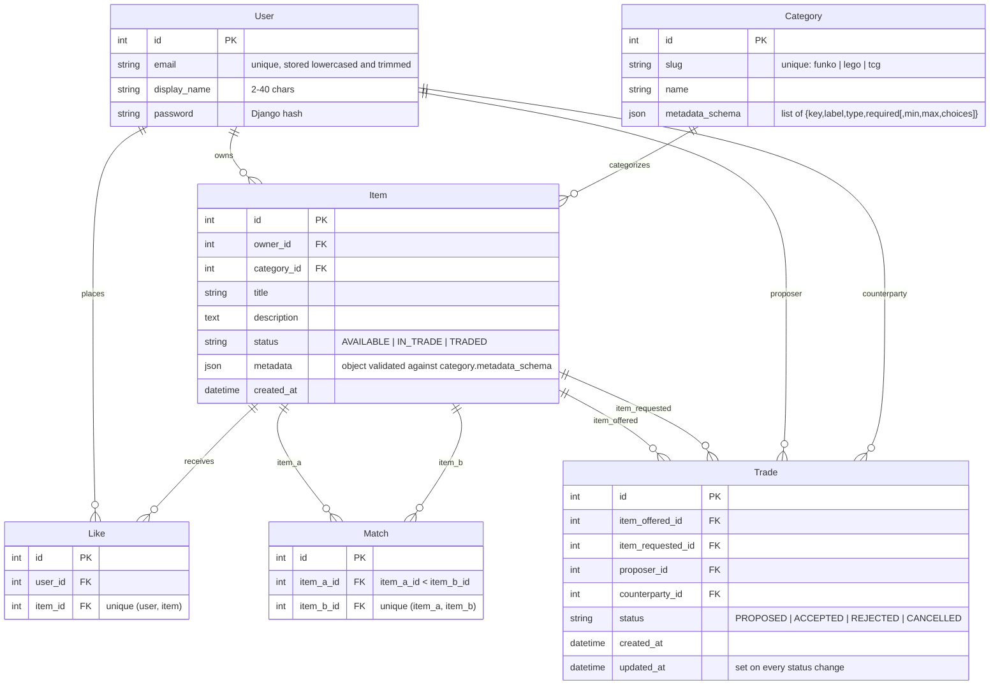
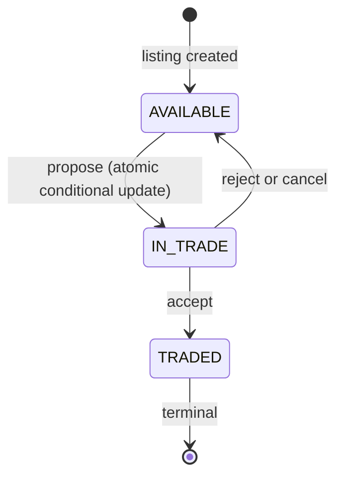
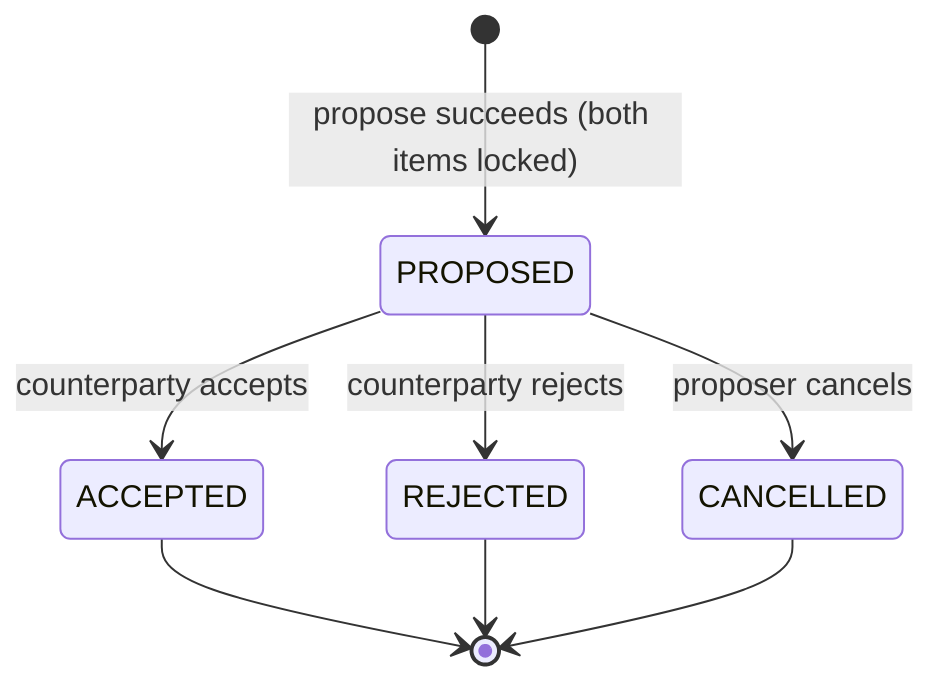

# Spec: Architecture

**Status:** Approved

This document fixes the technical shape of Easy Exchange: stack, data model, metadata validation, the trade state machine, the double-booking lock, and the testing focus. It expands sections 1–5 of [../docs/plan.md](../docs/plan.md) and uses the vocabulary of [00-overview.md](00-overview.md). Feature behavior (routes, forms, error messages) lives in the numbered specs; where this document and a numbered spec disagree on behavior, the numbered spec wins and this document should be revised.

## Stack decision

**Chosen:** Django, server-rendered templates, SQLite with `JSONField`, Python. This is Option A of plan section 1.

Reasons (from the plan):

- **Fast local demo.** One framework gives the ORM, migrations, and `runserver`; the whole demo is `python manage.py migrate && python manage.py seed && python manage.py runserver`. No cloud, no extra database process.
- **Built-in auth, admin, forms.** Session authentication, password hashing and validators, CSRF protection, the admin site, and the forms framework come with Django. Option B (Flask) would require rebuilding these; Option C (FastAPI + PostgreSQL) adds a second process and more moving parts than a few-day class demo needs.
- **`JSONField` on SQLite is enough** for the fixed per-category metadata. Metadata is validated in Python against `Category.metadata_schema` (see *Category metadata schemas*); no live JSON Schema engine.
- **Double-booking without row locks.** SQLite does not provide PostgreSQL-style row-level `SELECT ... FOR UPDATE`, so the lock is a conditional `UPDATE ... WHERE status='AVAILABLE'` plus a row-count check inside `transaction.atomic()` (see *Double-booking prevention*).

**PostgreSQL is a documented upgrade path, not a requirement.** The same models and the conditional-update pattern work unchanged on PostgreSQL; `JSONB` and `SELECT ... FOR UPDATE` are available tightenings there. Nothing in the MVP depends on PostgreSQL and nothing is built for it.

Rendering is server-side only: Django templates, plain HTML forms, no JavaScript framework, no client-side validation, no REST API.

### Django app structure

Three apps, matching plan Phase 1. Each app owns its models, forms, views, URL patterns, templates, and tests.

| App | Owns | Spec(s) |
| --- | --- | --- |
| `accounts` | `User` model; registration (`/register`); login (`/login`) and logout (`/logout`) with the session cookie | `01-user-registration.md`, `02-login-session.md` |
| `catalog` | `Category` and `Item` models; `metadata_schema` definitions for `funko`, `lego`, `tcg`; the Python metadata validator; dynamic listing form (fields built from `metadata_schema`); create / edit listing; public browse and listing detail with status badges; the `seed` management command | `03-listings.md`, `04-browse.md`, `07-seed-data.md` |
| `trades` | `Like`, `Match`, `Trade` models; the trade service (propose / accept / reject / cancel with the atomic lock); like action; match creation on reciprocal likes; the Matches page (matches, incoming, outgoing, finished trades) | `05-likes-matches.md`, `06-trades.md` |

Dependency direction: `trades` depends on `catalog` and `accounts`; `catalog` depends on `accounts`; `accounts` depends on neither. The `seed` command lives in `catalog` because it mostly creates categories and items, but it also creates users and likes (see *Seed data*).

Proposed folder layout (names only; no code in this spec):

```text
easy-exchange/
  manage.py
  config/                 # Django project package: settings, root urls, wsgi
  templates/              # base layout shared by all apps
  accounts/
    models.py             # User
    forms.py              # registration and login forms
    views.py  urls.py
    templates/accounts/
    tests/
  catalog/
    models.py             # Category, Item
    validators.py         # validate_metadata(category, metadata)
    forms.py              # listing form built from metadata_schema
    views.py  urls.py
    management/commands/seed.py
    templates/catalog/
    tests/
  trades/
    models.py             # Like, Match, Trade
    services.py           # propose_trade, accept_trade, reject_trade, cancel_trade, like_item
    views.py  urls.py
    templates/trades/
    tests/
  db.sqlite3              # local only, not committed
  docs/  specs/  PROCESS_LOG.md
```

**Business rule:** all state changes to `Item.status` and `Trade.status` go through `trades/services.py`. Views never update `Item.status` or `Trade.status` directly. This keeps the lock in one place and makes the service the unit under test.

**Business rule:** `AUTH_USER_MODEL` must be set to the custom `accounts.User` in settings **before the first migration is created or run**. Switching the user model after migrations exist is not supported by Django and would require resetting the database.

## Data model

Six models, exactly as named in the plan: `User`, `Category`, `Item`, `Like`, `Match`, `Trade`. Primary keys are Django's default integer `id`.



`Like` and `Match` carry no `created_at`; lists of likes and matches are ordered by `id`. Status fields are changed only by `trades/services.py` (business rule under *Django app structure*). The "one `PROPOSED` trade per item" invariant is guaranteed by the `IN_TRADE` lock alone; no additional database uniqueness constraint is added.

### `User` (app `accounts`)

| Field | Type | Constraints |
| --- | --- | --- |
| `email` | email string | Unique, case-insensitive. Normalized (trimmed, lowercased) before validation and storage, so a plain unique constraint on the stored value is sufficient (`01-user-registration.md`). Used as the login identifier. |
| `display_name` | string | 2–40 characters after trimming; not unique. |
| `password` | string | Django password hash; never plaintext. |

Decision: a custom `User(AbstractUser)` in `accounts` with `email` as the login field (`USERNAME_FIELD`) and no separate `username` requirement. **Rule:** `AUTH_USER_MODEL = "accounts.User"` must be set before the first migration is created or run (see the business rule under *Django app structure*).

### `Category` (app `catalog`)

| Field | Type | Constraints |
| --- | --- | --- |
| `slug` | string | Unique. MVP values: `funko`, `lego`, `tcg`. |
| `name` | string | Display name, e.g. "Funko Pop & Figures". |
| `metadata_schema` | `JSONField` (list) | List of field descriptors; each entry has the required keys `key`, `label`, `type`, `required` and the optional keys `min`, `max`, `choices`. See *Category metadata schemas*. |

Exactly three rows in the MVP, created by `seed`. Adding a category later means adding a row with a new `metadata_schema`, not a new table.

### `Item` (app `catalog`)

| Field | Type | Constraints |
| --- | --- | --- |
| `owner` | FK → `User` | Required. |
| `category` | FK → `Category` | Required. Not changed after creation. |
| `title` | string | Required. |
| `description` | text | Required (may be short). |
| `status` | string choices | `AVAILABLE` \| `IN_TRADE` \| `TRADED`. Default `AVAILABLE`. |
| `metadata` | `JSONField` (object) | Keys and values validated against `category.metadata_schema` on create and edit. |
| `created_at` | datetime | Set on create. |

Rules: an `Item` may be edited by its owner only while `status = AVAILABLE`; `IN_TRADE` and `TRADED` items are read-only for everyone. Items are never deleted in the MVP. `status` is changed only by the trade service.

### `Like` (app `trades`)

| Field | Type | Constraints |
| --- | --- | --- |
| `user` | FK → `User` | The user expressing interest. |
| `item` | FK → `Item` | The liked listing. |

Constraints: unique `(user, item)`. Service rule: `user != item.owner` (no likes on own items). Likes are append-only; there is no unlike, so a `Match` is never removed. Service rule (status): new likes are accepted on `AVAILABLE` and `IN_TRADE` items and refused on `TRADED` items — `like_item` raises `LikeNotAllowed` with the message `This listing has already been traded.` and writes nothing; existing likes are kept for history in any status but only `AVAILABLE` items can enter a trade (the propose lock refuses the rest). Defined in `05-likes-matches.md`.

### `Match` (app `trades`)

| Field | Type | Constraints |
| --- | --- | --- |
| `item_a` | FK → `Item` | The item with the smaller `id`. |
| `item_b` | FK → `Item` | The item with the larger `id`. |

Constraints: unique `(item_a, item_b)`; database check constraint `item_a_id < item_b_id` so each unordered pair is stored exactly once. Service rule: `item_a.owner != item_b.owner`. A `Match` is created when a like completes a reciprocal pair: owner of X has liked Y **and** owner of Y has liked X. The check runs inside the like action, after the new `Like` is saved, and the pair is ordered by `id` before the lookup or insert. A `Match` is the only starting point for a `Trade`.

### `Trade` (app `trades`)

| Field | Type | Constraints |
| --- | --- | --- |
| `item_offered` | FK → `Item` | Proposer's item. |
| `item_requested` | FK → `Item` | Counterparty's item. |
| `proposer` | FK → `User` | Owns `item_offered`. |
| `counterparty` | FK → `User` | Owns `item_requested`. |
| `status` | string choices | `PROPOSED` \| `ACCEPTED` \| `REJECTED` \| `CANCELLED`. Default `PROPOSED`. |
| `created_at` | datetime | Set on create. |
| `updated_at` | datetime | Set on every status change. These two fields are the plan's "timestamps". |

Service rules (enforced in `trades/services.py`, not as database constraints): `item_offered != item_requested`; `proposer == item_offered.owner`; `counterparty == item_requested.owner`; a `Match` exists for `{item_offered, item_requested}`; both items are `AVAILABLE` at the moment of the conditional update. An item is in at most one `PROPOSED` trade at a time; this is guaranteed by the `IN_TRADE` lock rather than by a uniqueness constraint.

## Category metadata schemas

### Storage on `Category`

`Category.metadata_schema` is a JSON list. Each entry is an object with four required keys and up to three optional keys:

| Entry key | Required | Meaning |
| --- | --- | --- |
| `key` | yes | The metadata key stored in `Item.metadata` |
| `label` | yes | Form label shown to the user |
| `type` | yes | One of `int`, `bool`, `str` |
| `required` | yes | `true` / `false` |
| `min` | no | Minimum allowed value (inclusive); `int` fields only |
| `max` | no | Maximum allowed value (inclusive); `int` fields only |
| `choices` | no | List of allowed string values; `str` fields only |

**Deliberate extension of the plan's entry format.** `docs/plan.md` and `specs/00-overview.md` describe entries as `key`, `label`, `type`, `required`. This spec adds the optional `min`, `max`, and `choices` so that the value rules (`box_condition` 1–10, `card_condition` choices) live in the schema data and the validator stays generic with no per-category code. The metadata **keys** and their rules are unchanged; only where the rules are stored changes. See *Open questions* for the follow-up edits to the plan and overview.

The MVP schemas, seeded by the `seed` command. These are the only metadata keys in the MVP; do not add character, line, vaulted, set number, or any other key.

| Category (`slug`) | Key | Type | Required | Rule | Encoded in entry as |
| --- | --- | --- | --- | --- | --- |
| `funko` | `box_condition` | int | yes | 1–10 | `min: 1, max: 10` |
| `funko` | `original_box_included` | bool | yes | | |
| `funko` | `serial_number` | str | yes | | |
| `lego` | `sealed_misb` | bool | yes | | |
| `lego` | `missing_parts` | bool | yes | | |
| `lego` | `year` | int | yes | | |
| `tcg` | `grading` | str | no | e.g. `PSA 10` | |
| `tcg` | `card_condition` | str | yes | `Mint` \| `Near Mint` \| `Played` | `choices: ["Mint", "Near Mint", "Played"]` |

Labels (proposed, user-facing only): "Box condition (1–10)", "Original box included", "Serial number", "Factory sealed (MISB)", "Missing parts", "Year", "Grading (company and score)", "Card condition".

### Schema configuration check

`min` / `max` are valid only on `int` entries and `choices` only on `str` entries. An invalid combination is a configuration error, never silently ignored. A second function in `catalog/validators.py`, `validate_metadata_schema(schema)`, checks a `metadata_schema` list whenever a category schema is loaded: in the `seed` command before the `Category` row is saved, and at the start of `validate_metadata` and the dynamic form build (so tests that construct a `Category` directly are covered too). It raises a clear configuration error (a Python exception naming the category `slug`, the entry `key`, and the offending entry key) when any of the following hold:

1. An entry is missing one of `key`, `label`, `type`, `required`, or has an entry key outside the seven allowed ones.
2. `type` is not one of `int`, `bool`, `str`.
3. `min` or `max` is present on an entry whose `type` is not `int`, or is not an integer, or `min > max`.
4. `choices` is present on an entry whose `type` is not `str`, or is not a non-empty list of distinct strings.
5. Two entries share the same `key`.

This error is not a form validation error; it is raised to the developer (seed command fails, test fails) because it means the category data itself is wrong.

### Server-side validation

A single Python function in `catalog/validators.py`, called `validate_metadata(category, metadata)`, runs on listing create and edit, and in the `seed` command. It is plain Python over the small field list; no JSON Schema library is used. It first runs `validate_metadata_schema` on the category's schema (configuration check above), then checks the item metadata, in order:

1. `metadata` must be a JSON object (dict); otherwise reject.
2. For every `metadata_schema` entry with `required = true`, the key must be present and its value must not be `null` or an empty string. For `bool` fields, `false` is a valid present value.
3. For every key present, the value must match the entry's `type`: `int` → integer (not a boolean, not a float); `bool` → boolean; `str` → string. Form input is coerced by the form layer before validation (text to int, checkbox to bool).
4. Value rules come from the entry itself, so the validator contains no category-specific code: if the entry has `min` or `max`, an `int` value must be within the inclusive bounds; if the entry has `choices`, a `str` value must be exactly one of the listed strings. Entries without these keys accept any value of the right type. In the MVP this means `funko.box_condition` must be 1–10 and `tcg.card_condition` must be `Mint`, `Near Mint`, or `Played`; optional `tcg.grading` has no `choices` and may be absent, blank, or any string.
5. Keys not declared in `metadata_schema` are rejected.

Each failing check produces a field-level error on the matching form field; the listing is not saved. Error messages are specified in `03-listings.md`.

### Dynamic form

The listing form in `catalog/forms.py` builds one form field per `metadata_schema` entry: `int` → integer input (with `min` / `max` when present), `bool` → checkbox, `str` → text input, or a select when the entry has `choices`; `label` and `required` come from the entry. On submit the form coerces the values and stores them in `Item.metadata` under the schema's `key` names. The category is chosen first and fixed for the life of the `Item`.

## State machine

### Item status



| From | To | Trigger | Who |
| --- | --- | --- | --- |
| — | `AVAILABLE` | Create listing | Logged-in user (becomes listing owner) |
| `AVAILABLE` | `IN_TRADE` | Propose a trade on a `Match` containing the item | Proposer (owner of `item_offered`); both items of the pair move together |
| `IN_TRADE` | `TRADED` | Accept the `PROPOSED` trade | Counterparty only; both items move together |
| `IN_TRADE` | `AVAILABLE` | Reject the `PROPOSED` trade | Counterparty only; both items move together |
| `IN_TRADE` | `AVAILABLE` | Cancel the `PROPOSED` trade | Proposer only; both items move together |
| `TRADED` | — | None | Terminal; no transition out |

Side rules: an `Item` may be edited only in `AVAILABLE`. New likes are accepted on `AVAILABLE` and `IN_TRADE` items and refused on `TRADED` items (`This listing has already been traded.`); existing likes are kept for history in any status but only `AVAILABLE` items can enter a trade. Status badges are public on browse and detail pages.

### Trade status



| From | To | Who | Effect on items |
| --- | --- | --- | --- |
| — | `PROPOSED` | Proposer | `AVAILABLE → IN_TRADE` for both, in the same transaction |
| `PROPOSED` | `ACCEPTED` | Counterparty | `IN_TRADE → TRADED` for both |
| `PROPOSED` | `REJECTED` | Counterparty | `IN_TRADE → AVAILABLE` for both |
| `PROPOSED` | `CANCELLED` | Proposer | `IN_TRADE → AVAILABLE` for both |

`ACCEPTED`, `REJECTED`, and `CANCELLED` are terminal: any further accept / reject / cancel on that trade is refused. The proposer cannot accept or reject their own proposal; the counterparty cannot cancel. After `REJECTED` or `CANCELLED`, a new propose on the same `Match` is allowed (items are `AVAILABLE` again). After `ACCEPTED`, every other `Match` involving either item is dead, because the items are `TRADED`.

Preconditions for propose (checked in the service before the lock): the actor is logged in; the actor owns `item_offered`; `item_offered` and `item_requested` have different owners; a `Match` exists for the pair. The "both items `AVAILABLE`" condition is not pre-checked by a read; it is enforced by the conditional update itself.

## Double-booking prevention

Double-booking is the same `Item` being in two non-terminal trades at once. The plan's accepted deviation is to **lock at propose, not at accept**: items become `IN_TRADE` when a trade is proposed. The lock is a single atomic conditional update; the service never reads the status and then writes it in a second step.

Propose, inside `transaction.atomic()`:

1. Run one conditional update over both rows: `UPDATE item SET status='IN_TRADE' WHERE id IN (offered_id, requested_id) AND status='AVAILABLE'` (in ORM terms, a `filter(id__in=..., status=AVAILABLE).update(status=IN_TRADE)`).
2. Read the affected row count returned by the update.
3. If the row count is **not exactly 2**, raise inside the block so the whole transaction rolls back (any single row that was updated is reverted) and refuse the propose. One or both items were already `IN_TRADE` or `TRADED`.
4. If the row count is 2, insert the `Trade` row with `status = PROPOSED` and commit.

Because the update and the trade insert are in one transaction, there is no window in which an item is `IN_TRADE` without a `PROPOSED` trade, or in which two proposes both observe `AVAILABLE` and both succeed: two overlapping proposes that share an item cannot both update that row from `AVAILABLE`, so at most one sees a count of 2.

Accept, reject, and cancel also run inside `transaction.atomic()` and use the same conditional pattern on the trade row: update the `Trade` `WHERE id = ? AND status = 'PROPOSED'` to the new status; if the row count is not 1, roll back and refuse (the trade was already resolved). Then update both items `WHERE status = 'IN_TRADE'` to `TRADED` (accept) or `AVAILABLE` (reject / cancel) and require a row count of 2. The item updates are expected to always succeed when the trade update succeeded, because items in a `PROPOSED` trade are always `IN_TRADE`; a count other than 2 indicates an invariant violation and still rolls back.

Consequences:

- An item has at most one `PROPOSED` trade at a time, guaranteed by the lock rather than by a uniqueness constraint.
- Other matches involving a locked item are inert until reject / cancel returns it to `AVAILABLE`, and dead once it is `TRADED`.
- Likes on locked or traded items are kept for history but cannot start a trade; the propose simply fails the row-count check.

**PostgreSQL note.** The conditional `UPDATE ... WHERE status='AVAILABLE'` plus row-count check is portable and remains correct on PostgreSQL. The usual PostgreSQL tightening is to first `SELECT ... FOR UPDATE` both item rows inside the transaction, **ordered by `id`** so two concurrent proposes always lock rows in the same order and cannot deadlock, then perform the update. Django exposes this as `select_for_update()` on the queryset. SQLite does not provide the same row-level lock semantics (it serializes writers at the database level), which is why the conditional update and row count are the MVP mechanism and `select_for_update()` is not relied on.

## Seed data

Details, exact demo accounts, and listing contents are in `07-seed-data.md`. The architectural principle:

- Seeding is a Django management command, `python manage.py seed`, run after `migrate` and idempotent enough to be re-run for the demo without creating duplicates.
- It creates the three `Category` rows with the exact `metadata_schema` above, **two demo users** with known credentials, and **one listing per user per category** (six `Item` rows, all `AVAILABLE`, metadata using only the keys above and passing `validate_metadata`).
- It creates **one reciprocal like pair** (user A liked one of user B's listings and user B liked one of user A's) through the same like logic as the UI, so exactly one `Match` exists on first load and can be used to propose a trade without clicking through likes.
- No seeded trades; no sports or other stretch categories.

## Testing approach

Tests use Django's test runner (`python manage.py test`) on SQLite and focus on `trades/services.py` and `catalog/validators.py`, not on templates. Each app has a `tests/` package; the cases below mirror plan section 5 and are the minimum. Tests call the service functions directly rather than driving the views, so the contract under test is the service API.

**State machine (`trades`)**

1. Propose on two `AVAILABLE` matched items: both become `IN_TRADE`; trade is `PROPOSED`; `proposer` / `counterparty` are the two owners.
2. Accept by the counterparty: both items `TRADED`; trade `ACCEPTED`. A further accept, reject, or cancel on the same trade is refused and nothing changes.
3. Reject by the counterparty: both items `AVAILABLE`; trade `REJECTED`; a new propose on the same pair succeeds.
4. Cancel by the proposer: both items `AVAILABLE`; trade `CANCELLED`; a new propose on the same pair succeeds.
5. Authorization: proposer cannot accept or reject; counterparty cannot cancel; a third user can do none of these.
6. Preconditions: cannot propose without a `Match`; cannot propose when the actor does not own `item_offered`; cannot propose own item vs own item.

**Double-booking (`trades`)**

7. After a successful propose, a second propose that includes `item_offered` fails (row count not 2); the first trade stays `PROPOSED`; both items stay `IN_TRADE`; no second `Trade` row exists.
8. Same as 7 for a second propose that includes `item_requested` paired with a third matched item.
9. Propose where one item is already `TRADED` fails and leaves the other item `AVAILABLE` (rollback of the single updated row).
10. Optional: a true parallel race using threads and `TransactionTestCase`. Not required; the contract is "the conditional update requires two `AVAILABLE` rows."

**Likes and matches (`trades`)**

11. A like on the user's own item is refused. A duplicate `(user, item)` like is idempotent: no error, no second row.
12. A single like creates no `Match`; the reciprocal like creates exactly one `Match` with `item_a_id < item_b_id`; a repeated reciprocal pair does not create a second `Match`.

12a. A like on an `IN_TRADE` item is allowed: the `Like` row is created exactly as for an `AVAILABLE` item, and if it completes a reciprocal pair the `Match` is created.

12b. A like on a `TRADED` item is refused: `like_item` raises `LikeNotAllowed` with the message `This listing has already been traded.`; no `Like` and no `Match` is created, even if the pair would otherwise be reciprocal.

**Metadata validation (`catalog`)**

13. For each category, a valid metadata object passes.
14. Missing required keys are rejected for each category; `tcg.grading` may be absent or blank.
15. `funko.box_condition` of 0 and 11 are rejected; 1 and 10 pass. Non-integer values are rejected.
16. `tcg.card_condition` outside `Mint` / `Near Mint` / `Played` is rejected.
17. Wrong types (string where int expected, string where bool expected) are rejected.
18. Undeclared keys are rejected.
19. Validator is generic: a `Category` created in a test with a new `metadata_schema` using `min` / `max` / `choices` is enforced without any code change.
20. Schema configuration check: `validate_metadata_schema` raises a configuration error for `min` or `max` on a `str` or `bool` entry, for `choices` on an `int` or `bool` entry, for `min > max`, for an empty `choices` list, for an unknown `type`, for a missing required entry key or an unknown entry key, and for duplicate `key` values. The three seeded MVP schemas pass the check.

Transaction handling in tests: `TestCase` wraps each test in a transaction, and `transaction.atomic()` inside the service becomes a savepoint, so rollback-on-failure is still observable by asserting statuses after the refused call. Only the optional race test needs `TransactionTestCase`.

## Open questions

1. **Resolved.** `docs/plan.md` and `specs/00-overview.md` now describe the optional `min`, `max`, `choices`.
